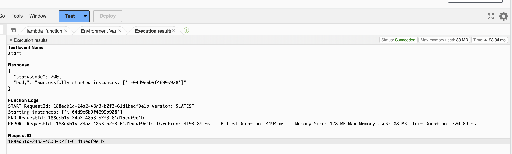

# Automated Instance Management Using AWS Lambda and Boto3

## Steps:
1. Create ec2 instances using ec2.py file which can create 2 instance with tags Auto-Start and Auto-Stop and Key name. Value will be any. (IAM ROLE: __AmazonEC2FullAccess__)

2. Creating Lambda function where python is using boto3 module and fetch all instanceID's with tags Auto-start and Auto-stop based on condition.
3. When invoking manually, has to provide 
```
   { "Auto-Start" : "TRUE" }

   or

   { "Auto-Stop" : "TRUE" }
```
   when key is Auto-start, lambda function is checking all instance with tag and start those instance simmalary for Auto-Stop also.

 
 
 
 
 
