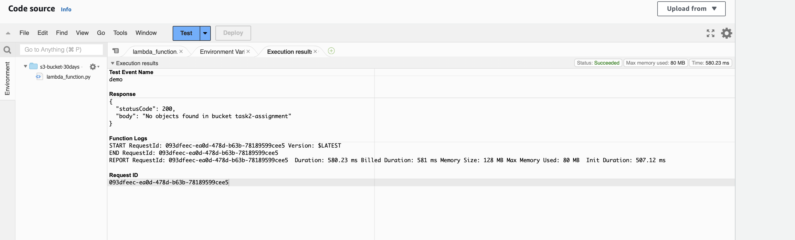

# Automated S3 Bucket Cleanup Using AWS Lambda and Boto3

### Steps:
1. Manual Trigger the Lambda function with empty bucket (IAM Policy : __AmazonS3ReadOnlyAccess__)

2. Upload any file in s3 bucket

3. Again trigger the lambda function 
