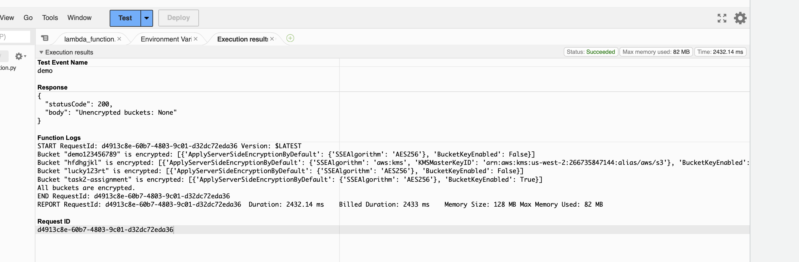
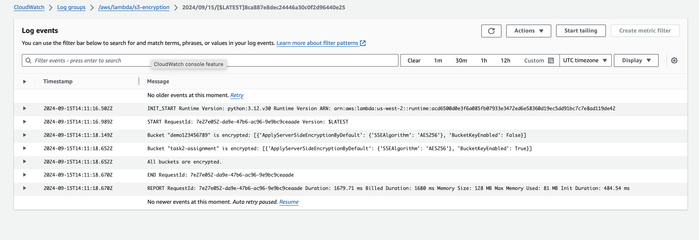
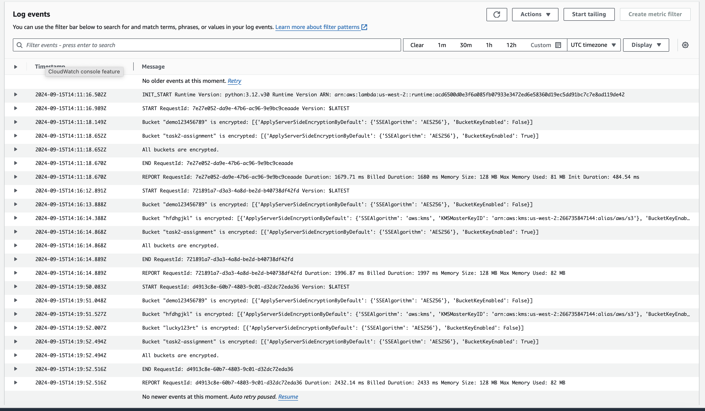
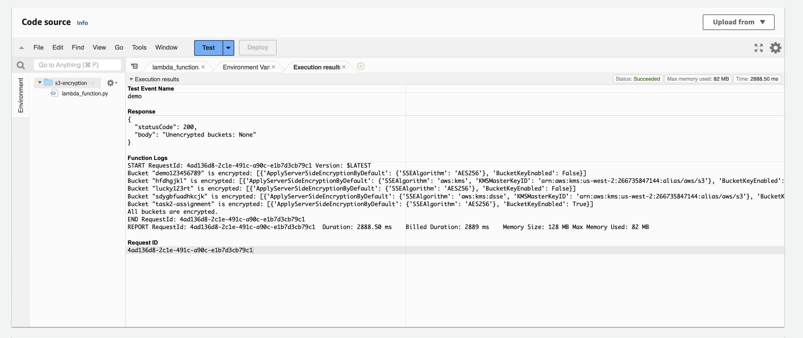

#  Monitor Unencrypted S3 Buckets Using AWS Lambda and Boto3

## Steps:
1. Create a Lambda Function with IMA policy __AmazonS3ReadOnlyAccess__ with given python code
2. Create multiple buckets.
3. Manully trigger the lambda function

4. Cloudwatch logs for multiple executions

