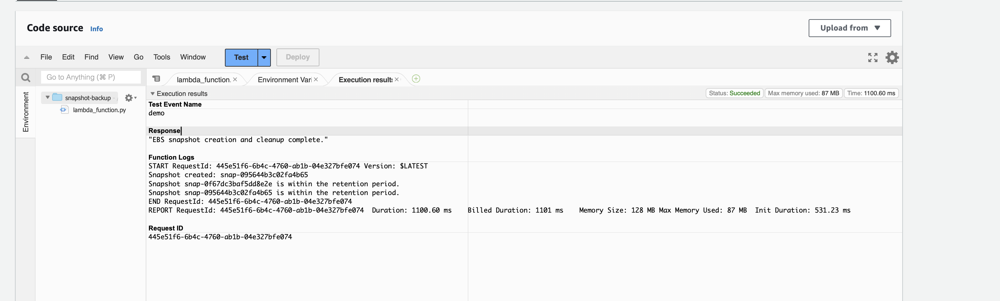
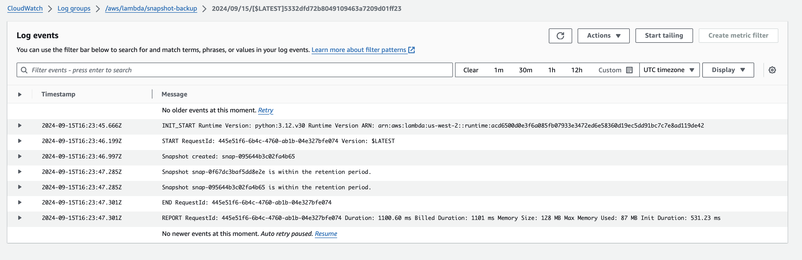
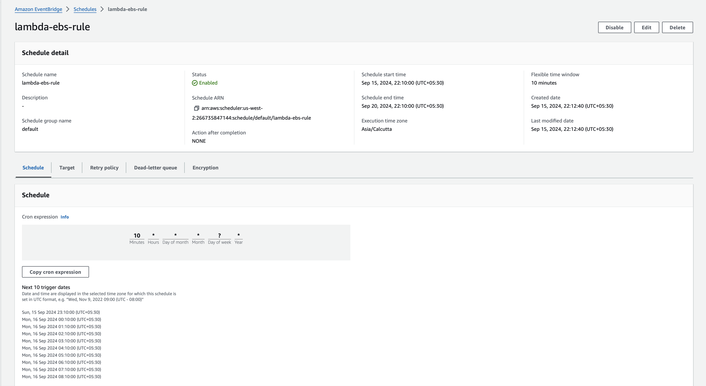
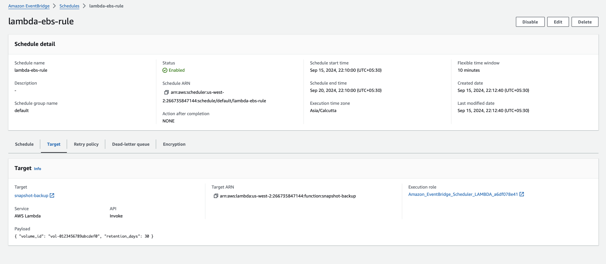
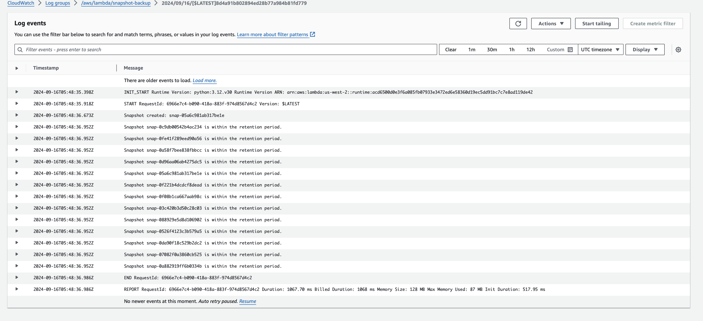
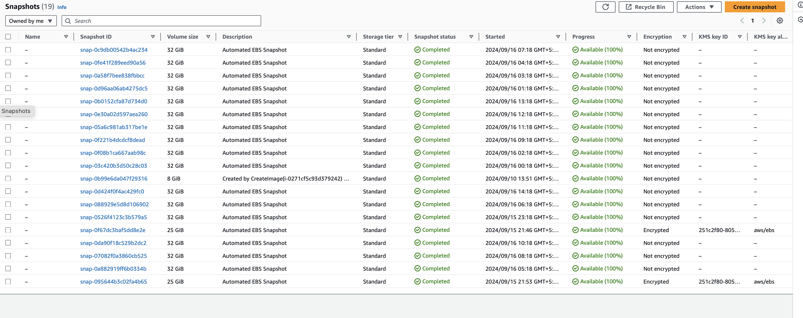

# Automatic EBS Snapshot and Cleanup Using AWS Lambda and Boto3

## Steps:
1. Create Lambda function with EC2 full access
2. Copy the python code from snaphot-backup.py file, to execute this file need to provide volume id and retention period in Test section like below.
  ```
   {
  "volume_id": "vol-0123456789abcdef0",
  "retention_days": 30
  }
```
3. Now start manual trigger this function



4. Now create Event Source from Cloudwatch to trigger the Lambda function at your desired backup frequency (e.g., for every 10mins for testing).


5. From the screenshots configured cornjobs for every 10mins.
6. Final output of rule after waitng 10hrs

